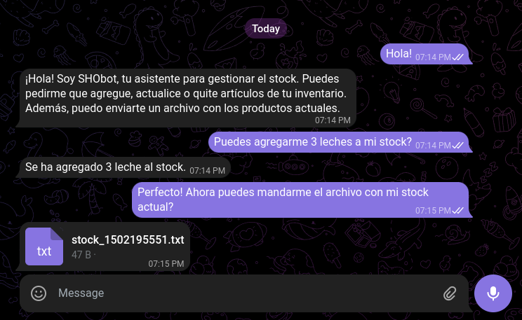

# Telegram Stock Bot

Este es un bot de Telegram que gestiona un stock simple del hogar. El bot está conectado a la API de Cohere, lo que le permite interpretar comandos en lenguaje natural y almacenar artículos en una base de datos PostgreSQL. Además, puede generar y enviar un archivo `.txt` con el stock actual.

## Características

- **Añadir items al stock:** El bot interpreta comandos del usuario y agrega artículos al stock del hogar.
- **Listar el stock actual:** Puedes pedirle al bot que te envíe un archivo `.txt` con la lista de artículos en stock.
- **Inteligencia Artificial:** Gracias a la API de Cohere, el bot entiende comandos en lenguaje natural sin necesidad de seguir una sintaxis estricta.
- **Base de datos PostgreSQL:** Los datos del stock se almacenan de manera persistente en una base de datos.

## Ejemplo de uso



## Requisitos

- [Go](https://golang.org/doc/install) 1.16 o superior.
- [PostgreSQL](https://www.postgresql.org/download/) para la base de datos.
- [Cohere API](https://docs.cohere.ai/docs) para el procesamiento de lenguaje natural.
- [Telegram Bot API](https://core.telegram.org/bots/api) para interactuar con el bot.

## Configuración

1. Clona el repositorio:

   ```bash
   git clone https://github.com/LucasA21/Bot_IA.git
   ```

2. Crea un archivo `.env` con las siguientes variables:

   ```env
    TELEGRAM_BOT_TOKEN=token_api_telegram
    COHERE_API_KEY=token_api_cohere
    DATABASE_URL=postgres_url

   ```

3. Instala las dependencias del proyecto:

   ```bash
   go mod tidy
   ```

4. Inicia el servidor PostgreSQL y crea la base de datos :

   ```sql
   CREATE DATABASE telegram_go;
   ```

5. Crear las tablas

   ```sql
   CREATE TABLE public.stock (
   user_id int8 NOT NULL,
   producto text NOT NULL,
   cantidad int4 NOT NULL,
   CONSTRAINT stock_pkey PRIMARY KEY (user_id, producto)
   );

   CREATE TABLE public.users (
   id serial4 NOT NULL,
   telegram_id int8 NOT NULL,
   username varchar(255) NOT NULL,
   created_at timestamp DEFAULT CURRENT_TIMESTAMP NULL,
   CONSTRAINT users_pkey PRIMARY KEY (id)
   ); 
   ```


5. Ejecuta la aplicación:

   ```bash
   go run main.go
   ```
